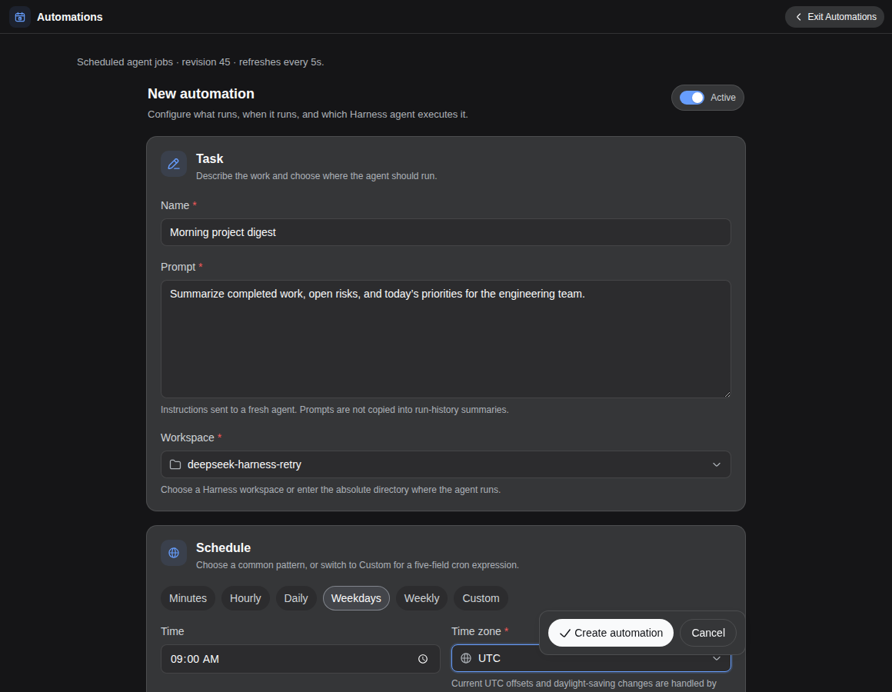

# DeepSeek Harness Automations

A DeepSeek Harness plugin for durable, configurable cron jobs. Each occurrence starts a fresh persisted Harness Agent in a selected workspace with an explicit model route, agent preset, and permission preset.

> **Status:** MVP compatible with `@deepseek-ai/dsh` `0.1.1-rc.2` and `0.1.2-rc.1`. The current worker is single-host. Cron admission and run history are durable; an already-started run is deliberately **not** retried after a host crash.

<p align="center">
  
</p>

## What works

- Standard five-field cron expressions with `UTC` or IANA timezones.
- Per-job workspace, provider/model, reasoning effort, agent preset, permission preset, and timeout.
- Enable/disable, Run now, edit, delete, cancel, and recent run history from a full center workspace opened by the main **Automations** sidebar action, or from **Settings → Automations**.
- Automation-created chats use the automation name as their durable session title and show a compact **Auto** badge in regular and searched history.
- Overlap policies:
  - `skip` — record and skip an occurrence while the job has queued/running work.
  - `queue` — serialize occurrences for the same job.
  - `allow` — permit concurrent occurrences, bounded by the global concurrency limit.
- Misfire policies:
  - `skip` — record an overdue occurrence as skipped.
  - `run-once` — coalesce missed occurrences to the latest due time.
- Atomic owner-private state under `$DSH_HOME/automations/state.json` by default.
- Immutable execution snapshots and occurrence keys for replay-safe admission.
- Extensible executor registry: the MVP ships `agent`; future `workflow` and task-graph executors do not need scheduler changes.

The in-box `@deepseek-ai/dsh-schedule` plugin remains the right tool for reminders attached to one live Session. This plugin owns deployment-level jobs that can start a fresh workspace Session while no chat is open.

## Install

Requirements:

- Node.js 22 or newer.
- DeepSeek Harness `0.1.1-rc.2` or a compatible release with a working `dsh web` profile.
- At least one configured provider/model route and usable agent and permission presets.
- pnpm 11 through Corepack only when installing from a source checkout.

From npm:

```bash
dsh plugin --profile web add @syncended/dsh-automations
```

Or from this checkout:

```bash
pnpm install
pnpm check

dsh plugin --profile web add .
```

The package declares a DSH bundle, so `dsh plugin` appends it to the Web profile automatically. Restart the running `dsh web` process after installing or upgrading, refresh the existing page, and open **Automations** from the main sidebar or **Settings → Automations**. Create a small disabled job first, save it, then use **Run now** to verify the selected model, workspace, and permission preset.

The browser client uses the same-origin `/api/automations` endpoint exposed by that Host. No separate connection URL, token, or plugin-specific environment variable is required; `DSH_HOME` only controls the normal Harness state location.

To remove it:

```bash
dsh plugin --profile web remove @syncended/dsh-automations
```

## Configure a job

| Field | Meaning |
|---|---|
| Name | Human-readable job name. |
| Schedule | Choose Minutes, Hourly, Daily, Weekdays, or Weekly and adjust its simple controls. Custom exposes the raw five-field cron (`minute hour day-of-month month day-of-week`) with an inline field guide. |
| Time zone | Search by city or region in the picker, or enter `UTC` / an IANA name such as `Europe/Berlin`. Current UTC offsets are shown; DST is handled by `cron-parser`. |
| Workspace | Choose an existing Harness workspace or enter an absolute directory manually. Its canonical filesystem identity becomes the Session cwd and `workspace-write` root. |
| Prompt | The user message sent to a fresh Harness Agent. |
| Model | Choose from one searchable model list grouped under provider titles, or enter an unlisted `provider/model` route. Leave blank to resolve the current Harness default at dispatch time. |
| Reasoning effort | Choose `Default` or an exact-model effort advertised by the adapter. If capability lookup is unavailable, common IDs are shown as advisory fallbacks; custom IDs remain editable and are validated when the run starts. |
| Agent preset | Leave blank for the current Harness default, or select a specific composition. |
| Permission preset | Bundles DSH sandbox and approval policies. Default: `workspace-write`. |
| Timeout | Wall-clock run limit. Cancellation is cooperative through the Agent loop. |
| Overlap / misfire | Admission behavior described above. |

The form groups common settings into **Task**, **Schedule**, and **Agent & access**. Job ID, timeout, overlap, and misfire stay available in the collapsed **Advanced** section. A paused job may still be started with **Run now**.

## Plugin configuration

Defaults are suitable for a local Web profile. Edit the existing `automations` row in `$DSH_HOME/profiles/web/cordis.patch.yml` when needed; do not add a duplicate row with the same id. Restart the Host after changing it:

```yaml
- id: automations
  config:
    maxConcurrentRuns: 2
    historyLimit: 1000
    misfireGraceMs: 60000
    maxOutputChars: 65536
    allowedProjectRoots:
      - /home/me/projects
    # Optional alternate Harness home used only to derive the default state path.
    # dshHome: /absolute/private/dsh-home
    # Optional; otherwise <dshHome or $DSH_HOME>/automations/state.json.
    # A leading ~ is expanded; the resulting path must be absolute.
    # statePath: /absolute/private/path/state.json
```

`allowedProjectRoots: []` means the plugin accepts any existing directory the Harness host account can resolve. Configure one or more existing roots when the Web surface is exposed beyond a trusted local machine. Roots and job workspaces are canonicalized with `realpath`, so deleted paths and symlink retargeting fail closed.

Validated service ranges: `maxConcurrentRuns` 1–32, `historyLimit` 10–10,000, `misfireGraceMs` 0–86,400,000, and `maxOutputChars` 1,024–1,048,576. Job names are limited to 120 characters, prompts to 131,072 characters, IDs to 63 lowercase letters/digits/hyphens, and timeouts to 1 second–24 hours. Blank model or preset selections resolve against the current Harness defaults at dispatch time, so future runs can follow later default changes.

## Durable semantics

1. The scheduler claims an occurrence and advances its durable `nextRunAt` watermark in the **same atomic state mutation**.
2. The admitted run pins the complete job version and gets a unique occurrence key.
3. `queued` runs are dispatched after restart.
4. A run is marked `running` before any Agent work starts.
5. On restart, orphaned `running` records become `interrupted` and are not retried automatically, avoiding silent duplicate file/network effects.
6. Harness Session persistence remains the source of truth for the Agent transcript; the automation state stores orchestration metadata and a bounded final-text summary.

This is not exactly-once execution. Exactly-once external side effects require idempotency in the task itself or in the target system.

## Security

- State files are replaced atomically with mode `0600`; created directories use `0700`.
- Workspace paths are resolved through `realpath`; optional allowed roots are checked against that canonical identity.
- Background work uses a normal DSH permission preset. `workspace-write` cannot silently widen itself; unattended approval failures remain fail-closed.
- `danger-full-access` is intentionally available only when the job author selects a configured preset that grants it.
- The management API requires JSON plus a custom same-origin mutation header. It inherits the trust boundary of the DSH Web server, which has no standalone authentication layer.
- Prompts, run metadata, final summaries, and Session transcripts are local sensitive data.

See [`docs/security.md`](docs/security.md) for the threat model.

## Development

```bash
pnpm typecheck
pnpm test
pnpm check
```

The Host plugin is TypeScript in `src/`. The browser half is deliberately plain JavaScript in `lib/client.js`, matching the external DSH Client Plugin loader format and avoiding a dependency on monorepo-only frontend build tooling.

## License

MIT
